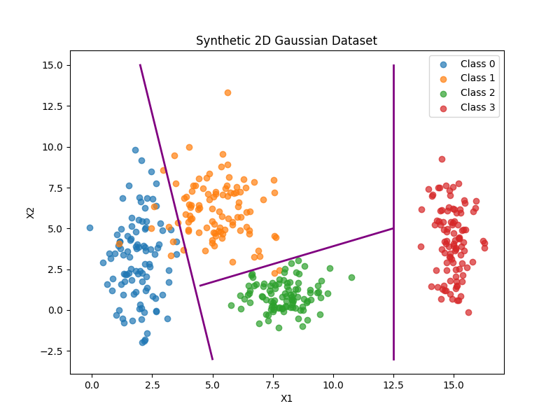
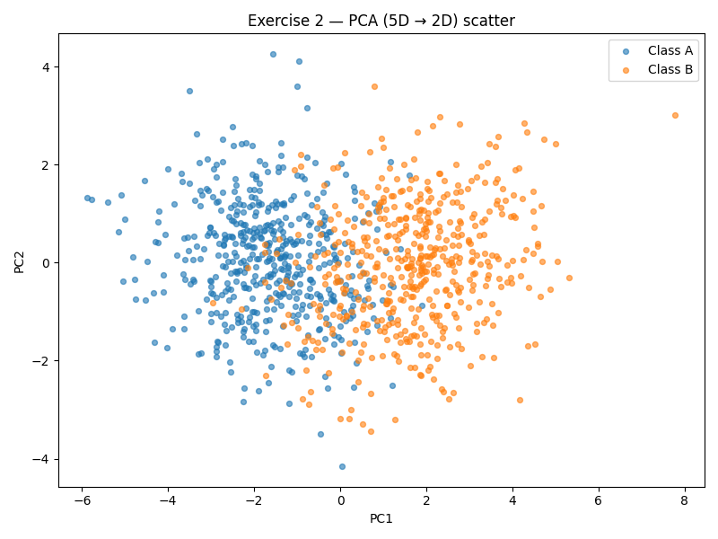
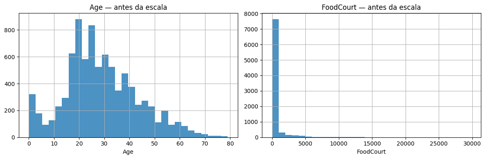
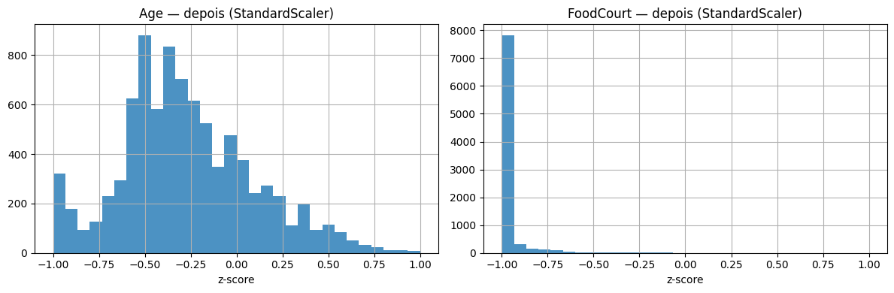

# Deep Learning — Data

  **Autor:** *Caio Ortega Boa*  
  **Disciplina:** Deep Learning  
  **Período:** 2025.1  

---

## Sumário

- **Exercício 1:** Separabilidade em 2D (dados sintéticos gaussianos)  
- **Exercício 2:** Não-linearidade em 5D e projeção PCA → 2D  
- **Exercício 3:** Pré-processamento do *Spaceship Titanic* (Kaggle) para MLP com `tanh`

---

## Exercício 1 — Class Separability em 2D

**Objetivo.** Explorar como a distribuição de quatro classes em 2D influencia a complexidade das fronteiras de decisão que uma rede neural precisaria aprender.

**Parâmetros utilizados (por classe).**  
Médias (μx, μy): **(2,3)**, **(5,6)**, **(8,1)**, **(15,4)**  
Desvios (σx, σy): **(0,8; 2,5)**, **(1,2; 1,9)**, **(0,9; 0,9)**, **(0,5; 2,0)**  
*Observação:* desvios por eixo ⇒ **elipses alinhadas aos eixos** (covariância diagonal, sem rotação).

**Visualização.**   


**Análise e respostas.**
- **Distribuição e overlap:** Classes 0 e 1 apresentam sobreposição considerável enquanto as classes 1 e 2 apresentam leve sobreposição; a Classe 3 está deslocada à direita sem nenhuma sobreposição.  
- **Uma fronteira linear simples separa tudo?** Não. Com uma única fronteira linear não é possível separar todas as classes corretamente.  
- **“Sketch” das fronteiras que a rede aprenderia:** Para separar de maneira eficiente todas as classes seriam necessárias pelo menos 3 fronteiras lineares.

**Código**
```python
import numpy as np
import matplotlib.pyplot as plt

# Garante reprodutibilidade dos números aleatórios
np.random.seed(42)

def draw_line(ax, point1, point2, style='--', color='k', lw=2):
    """
    Desenha uma linha entre dois pontos no gráfico.

    Parâmetros:
    - ax: objeto matplotlib.axes onde a linha será desenhada.
    - point1: tupla (x1, y1) do primeiro ponto.
    - point2: tupla (x2, y2) do segundo ponto.
    - style: estilo da linha (default='--' tracejada).
    - color: cor da linha (default='k' preto).
    - lw: espessura da linha.
    - label: legenda opcional para a linha.
    """
    x_vals = [point1[0], point2[0]]
    y_vals = [point1[1], point2[1]]
    ax.plot(x_vals, y_vals, style, color=color, lw=lw)

# Parâmetros das distribuições gaussianas:
# means = lista de tuplas (μx, μy) = médias em cada eixo
# stds = lista de tuplas (σx, σy) = desvios em cada eixo
means = [(2,3), (5,6), (8,1), (15,4)]
stds = [(0.8,2.5), (1.2,1.9), (0.9,0.9), (0.5,2.0)]

# Listas para acumular pontos (X) e rótulos (y)
X = []
y = []

# Para cada classe (0,1,2,3) gera 100 pontos 2D
# np.random.normal aceita tuplas em loc/scale
# loc=(μx, μy) => média por eixo
# scale=(σx, σy) => desvio por eixo
# Isso equivale a gaussianas 2D com covariância diagonal
for i, (mean, std) in enumerate(zip(means, stds)):
    points = np.random.normal(loc=mean, scale=std, size=(100,2))
    X.append(points)               # pontos da classe i
    y.append(np.full(100, i))      # vetor [i, i, ..., i] (100 vezes)

# Empilha todas as classes em um único array
X = np.vstack(X)  # shape (400, 2)
y = np.hstack(y)  # shape (400,)

# Cria o gráfico de dispersão
fig, ax = plt.subplots(figsize=(8,6))
for i in range(4):
    # Plota os pontos da classe i
    ax.scatter(X[y==i,0], X[y==i,1], label=f'Class {i}', alpha=0.7)

#Desenhando linhas arbitrarias de separação
draw_line(ax, (5,-3), (2,15), style='-', color='purple')
draw_line(ax, (4.5,1.5), (12.5,5), style='-', color='purple')
draw_line(ax, (12.5,-3), (12.5,15), style='-', color='purple')

ax.legend()
ax.set_title("Synthetic 2D Gaussian Dataset")
ax.set_xlabel("X1")
ax.set_ylabel("X2")
plt.show()
```

---

## Exercício 2 — Não-linearidade em 5D + PCA (5D → 2D)

**Objetivo.** Criar dois grupos 5D com médias/covariâncias especificadas e visualizar em 2D via **PCA**.

**Configuração.**  
- **Classe A:** vetor de média nulo; covariâncias positivas entre algumas dimensões.  
- **Classe B:** vetor de média transladado (1,5 em todas as componentes); covariâncias com sinais distintos, alterando forma e orientação do grupo.

**Visualização.**  


**Análise e respostas.**
- **Relação entre as classes (projeção 2D):** Observa-se mistura parcial, embora possa se identificar certa separação entre as nuvens.  
- **Separabilidade linear:** Embora possa ser observado uma distribuição com certa separação na projeção 2d dos dados, uma separação linear seria muito ineficiente para o caso proposto. Por haverem múltiplas dimensões nos dados a separabilidade linear tenderia a perder muita informação, por não haver um hiperplano perfeito capaz de separar as duas classes.

**Código**
```python
import numpy as np
import matplotlib.pyplot as plt
from sklearn.decomposition import PCA

# Reprodutibilidade
np.random.seed(42)

# -----------------------------
# 1) Define parâmetros 5D
# -----------------------------
# Classe A
mu_A = np.array([0.0, 0.0, 0.0, 0.0, 0.0])
Sigma_A = np.array([
    [1.0, 0.8, 0.1, 0.0, 0.0],
    [0.8, 1.0, 0.3, 0.0, 0.0],
    [0.1, 0.3, 1.0, 0.5, 0.0],
    [0.0, 0.3, 0.5, 1.0, 0.2],
    [0.0, 0.0, 0.0, 0.2, 1.0],
], dtype=float)

# Classe B
mu_B = np.array([1.5, 1.5, 1.5, 1.5, 1.5])
Sigma_B = np.array([
    [ 1.5, -0.7,  0.2,  0.0, 0.0],
    [-0.7,  1.5,  0.4,  0.0, 0.0],
    [ 0.2,  0.4,  1.5,  0.6, 0.0],
    [ 0.0,  0.0,  0.6,  1.5, 0.3],
    [ 0.0,  0.0,  0.0,  0.3, 1.5],
], dtype=float)

# -----------------------------
# 2) Geração dos dados (5D)
# -----------------------------
nA, nB = 500, 500
XA = np.random.multivariate_normal(mean=mu_A, cov=Sigma_A, size=nA)
XB = np.random.multivariate_normal(mean=mu_B, cov=Sigma_B, size=nB)

# Empilha dados e rótulos
X_5d = np.vstack([XA, XB])         # (1000, 5)
y    = np.array([0]*nA + [1]*nB)  # 0 = Classe A, 1 = Classe B

# -----------------------------
# 3) Redução de dimensionalidade (PCA → 2D)
# -----------------------------
pca = PCA(n_components=2, random_state=42)
X_2d = pca.fit_transform(X_5d)     # (1000, 2)

# -----------------------------
# 4) Visualização (apenas pontos)
# -----------------------------
plt.figure(figsize=(8, 6))
plt.scatter(X_2d[y==0, 0], X_2d[y==0, 1], alpha=0.6, s=18, label="Class A")
plt.scatter(X_2d[y==1, 0], X_2d[y==1, 1], alpha=0.6, s=18, label="Class B")
plt.xlabel("PC1")
plt.ylabel("PC2")
plt.title("Exercise 2 — PCA (5D → 2D) scatter")
plt.legend()
plt.tight_layout()
plt.show()
```

---

## Exercício 3 — *Spaceship Titanic* (Kaggle): Pré-processamento para `tanh`

**Objetivo.** Preparar dados reais para uma MLP com `tanh`, assegurando entradas estáveis.

### Descrição do dataset

- **Objetivo do Dataset** O Dataset simula um "Titanic espacial", que estaria lotado de passageiros e colidiu com uma anomalia espacial que trasnportou diversos passageiros para outra dimensão. O objetivo do dataset é descobrir quais passageiros teriam sido transportados para essa dimensão alternativa baseado em seus dados.
- **Alvo:** `Transported` — indica se o passageiro foi transportado para outra dimensão (binário).  
- **Numéricas:** `Age`, `RoomService`, `FoodCourt`, `ShoppingMall`, `Spa`, `VRDeck`, `CabinNum`, `Group`, `PaxInGroup`, `TotalSpend`.  
- **Categóricas:** `HomePlanet`, `CryoSleep`, `Destination`, `VIP`, `CabinDeck`, `CabinSide`.  
- **Engenharia aplicada:**  
  - `Cabin` decomposta em `CabinDeck`, `CabinNum`, `CabinSide`;  
  - `PassengerId` decomposto em `Group`, `PaxInGroup`;  
  - `Transported` convertido para 0/1.

### Faltantes

- **Investigação** Todas as colunas, fora `PassengerId` e `Transported` possuiam dados faltantes.
- **Numéricas:** imputação pela **mediana** (robusta a outliers; preserva a posição central).  
- **Categóricas:** imputação pela **moda** (mantém rótulos conhecidos; evita categorias artificiais).  

### Tratamento das Features

- **One-Hot Encoding** Utilizado para tratamento de features categóricas.
- **Normalização para `[-1, 1]`:** Utilizado para tratamento de features numéricas, de modo a acomodar os dados corretamente para a utilização da função de ativação `tanh`. Se trata de uma boa prática pois possibilita padroniza a escala das features e possibilita que a maior parte dos dados esteja na parte central da curva, otimizando o treinamento.

### Visualizações

**Antes da transformação**  


**Depois da transformação** 


**Código**

```python
#Imports e leitura
import numpy as np
import pandas as pd
import matplotlib.pyplot as plt

from sklearn.model_selection import train_test_split
from sklearn.compose import ColumnTransformer
from sklearn.preprocessing import OneHotEncoder, MinMaxScaler
from sklearn.preprocessing import MinMaxScaler
from sklearn.impute import SimpleImputer
from sklearn.pipeline import Pipeline

#Configs visuais
plt.rcParams["figure.figsize"] = (8, 5)
plt.rcParams["axes.grid"] = True

#Reprodutibilidade
np.random.seed(42)

#Caminho do arquivo
CSV_PATH = "spaceship.csv"

df = pd.read_csv(CSV_PATH)
print(df.shape)
df.head()
```

```python
#Visão geral: tipos e faltantes
print("\n=== info() ===")
df.info()

print("\n=== Missing values por coluna ===")
missing_abs = df.isna().sum().sort_values(ascending=False)
missing_pct = (df.isna().mean()*100).sort_values(ascending=False)
display(pd.DataFrame({"missing": missing_abs, "missing_%": missing_pct.round(2)}))
```

```python
#Quebra Cabin em deck/num/side
cabin = df["Cabin"].astype("string")
parts = cabin.str.split("/", expand=True)
df["CabinDeck"] = parts[0]
df["CabinNum"]  = pd.to_numeric(parts[1], errors="coerce")
df["CabinSide"] = parts[2]

#Quebra PassengerId em grupo e índice no grupo
pid = df["PassengerId"].astype("string")
grp_pp = pid.str.split("_", expand=True)
df["Group"] = pd.to_numeric(grp_pp[0], errors="coerce")  
df["PaxInGroup"] = pd.to_numeric(grp_pp[1], errors="coerce")

#Transported -> 0/1
df["Transported"] = df["Transported"].map({True:1, False:0, "True":1, "False":0}).astype(int)

#Colunas que não vamos usar como features
drop_cols = ["PassengerId", "Name", "Cabin"] 

#Colunas numéricas e categóricas
numeric_features = ["Age", "RoomService", "FoodCourt", "ShoppingMall", "Spa", "VRDeck", "Group", "CabinNum", "PaxInGroup"]
categorical_features = ["HomePlanet", "CryoSleep", "Destination", "VIP", "CabinDeck", "CabinSide"]

print("numeric_features:", numeric_features)
print("categorical_features:", categorical_features)

df_pre = df.drop(columns=drop_cols).copy()
df_pre.head()
```

```python
#Separação X, y
target = "Transported"
X = df_pre.drop(columns=[target])
y = df_pre[target].values
```

```python
#Sanitização (Correção de erros no processamento)
X = X.copy()

#Booleans para strings
for col in ["CryoSleep", "VIP"]:
    if col in X.columns:
        X[col] = X[col].map({True: "True", False: "False"}).astype("object")

#CATEGÓRICAS como 'object' e remover pd.NA
for c in categorical_features:
    if c in X.columns:
        X[c] = X[c].astype("object")
        mask = pd.isna(X[c])
        if mask.any():
            X.loc[mask, c] = np.nan

#NUMÉRICAS realmente numéricas
for c in numeric_features:
    if c in X.columns:
        X[c] = pd.to_numeric(X[c], errors="coerce")
```

```python
# Numéricas: imputar mediana + scaler (-1, 1)
num_pipe = Pipeline(steps=[
    ("imputer", SimpleImputer(strategy="median")),
    ("scaler",  MinMaxScaler(feature_range=(-1, 1))),
])

# Categóricas: imputar moda + OneHot
cat_pipe = Pipeline(steps=[
    ("imputer", SimpleImputer(strategy="most_frequent")),
    ("onehot",  OneHotEncoder(handle_unknown="ignore", sparse_output=False)),
])

preprocessor = ColumnTransformer(
    transformers=[
        ("num", num_pipe, numeric_features),
        ("cat", cat_pipe, categorical_features),
    ],
    remainder="drop",
)

X_proc = preprocessor.fit_transform(X)

print("X_proc shape:", X_proc.shape)
```

```python
#Checagem de colunas após OHE
num_names = numeric_features
cat_names = preprocessor.named_transformers_["cat"]["onehot"].get_feature_names_out(categorical_features).tolist()
final_feature_names = num_names + cat_names

print("Total de colunas após OHE:", len(final_feature_names))
```

```python
#Plotagem dos histogramas
fig, axes = plt.subplots(1, 2, figsize=(12, 4))

# Antes
X["Age"].hist(ax=axes[0], bins=30, alpha=0.8)
axes[0].set_title("Age — antes da escala")
axes[0].set_xlabel("Age")

X["FoodCourt"].hist(ax=axes[1], bins=30, alpha=0.8)
axes[1].set_title("FoodCourt — antes da escala")
axes[1].set_xlabel("FoodCourt")
plt.tight_layout()
plt.show()

# Depois
age_idx = numeric_features.index("Age")
food_idx = numeric_features.index("FoodCourt")

age_scaled   = X_proc[:, age_idx]
food_scaled  = X_proc[:, food_idx]

fig, axes = plt.subplots(1, 2, figsize=(12, 4))
axes[0].hist(age_scaled, bins=30, alpha=0.8)
axes[0].set_title("Age — depois (StandardScaler)")
axes[0].set_xlabel("z-score")

axes[1].hist(food_scaled, bins=30, alpha=0.8)
axes[1].set_title("FoodCourt — depois (StandardScaler)")
axes[1].set_xlabel("z-score")
plt.tight_layout()
plt.show()
```
