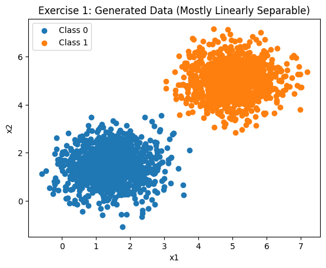
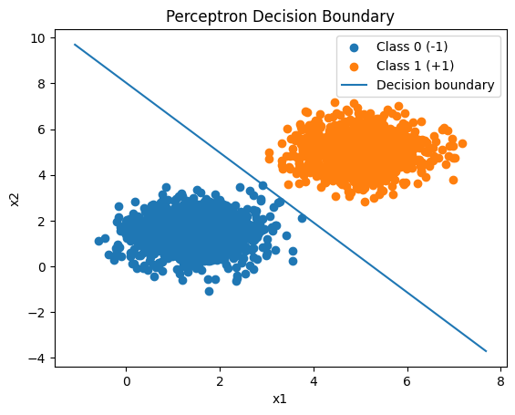
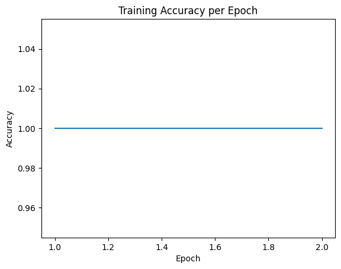
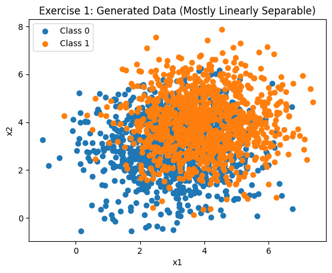
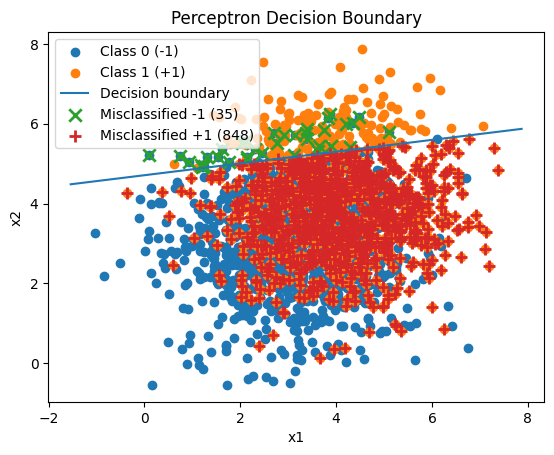
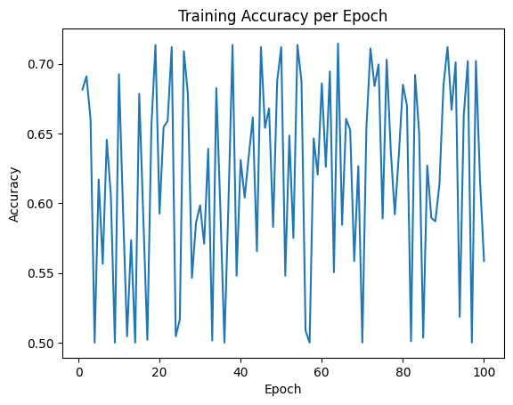

# Deep Learning — Perceptron

  **Autor:** *Caio Ortega Boa*  
  **Disciplina:** Deep Learning  
  **Período:** 2025.1  
  [Link do Repositório](https://github.com/CaioBoa/DeepLearningPerceptron)

---

## Sumário

- **Perceptron** Implementação de um Perceptron
- **Exercício 1:** Treinamento de Perceptron com Convergência 
- **Exercício 2:** Treinamento de Perceptron sem Convergência

---

## Perceptron — Implementação de um Perceptron

**Objetivo.** Implementação de um Perceptron sem utilização de bibliotecas auxiliares e modelos prontos, apenas Numpy para cálculos matriciais.

### Código
```python
import numpy as np

class Perceptron:
    """
    Single-layer Perceptron implemented from scratch.
    """
    def __init__(
        self,
        lr: float = 0.1,
        max_epochs: int = 100,
        random_state: int | None = None,
        track_history: bool = True,
    ):
        self.lr = lr
        self.max_epochs = max_epochs
        self.random_state = random_state
        self.track_history = track_history

        self.w = None
        self.b = 0.0
        self.accuracy_history_ = []

    def decision_function(self, X: np.ndarray) -> np.ndarray:
        """
        Compute raw scores (w·x + b).
        X: shape (n_samples, n_features)
        """
        if self.w is None:
            raise ValueError("Model is not fitted yet.")
        return X @ self.w + self.b

    def predict(self, X: np.ndarray) -> np.ndarray:
        """
        Predict labels in {-1, +1} using sign(w·x + b).
        """
        scores = self.decision_function(X)
        return np.where(scores >= 0, 1, -1)

    def fit(self, X: np.ndarray, y: np.ndarray) -> dict:
        """
        Fit the perceptron on labels in {-1, +1}.
        Stops early if an epoch completes with zero updates.
        Records accuracy after each epoch.
        Returns a training log with 'epochs_run' and 'converged' keys.
        """
        rng = np.random.default_rng(self.random_state)
        n_samples, n_features = X.shape

        # Initialize parameters
        self.w = np.zeros(n_features, dtype=float)
        self.b = 0.0
        self.accuracy_history_ = []

        indices = np.arange(n_samples)

        converged = False
        epochs_run = 0

        for epoch in range(self.max_epochs):
            epochs_run += 1
            # Shuffle each epoch for robustness
            rng.shuffle(indices)
            updates = 0

            for idx in indices:
                x_i = X[idx]
                y_i = y[idx]  # must be -1 or +1
                margin = y_i * (np.dot(self.w, x_i) + self.b)
                if margin <= 0:
                    # Misclassified -> update
                    self.w = self.w + self.lr * y_i * x_i
                    self.b = self.b + self.lr * y_i
                    updates += 1

            # Accuracy after epoch
            y_pred = self.predict(X)
            acc = np.mean(y_pred == y)
            self.accuracy_history_.append(acc)

            if updates == 0:
                converged = True
                break

        return {"epochs_run": epochs_run, "converged": converged}
```

---

## Exercício 1 — Treinamento de Perceptron com Convergência

**Objetivo.** Gerar um dataset 2d com clara distinção entre classes para realização do treinamento de um perceptron.

### Parâmetros utilizados
- **Médias (μx, μy):** (1.5,1.5), (5,5)
- **Desvios (σx, σy):** (0.5; 0), (0; 0.5)

### Visualização   




### Resultados
- **Final Weights** [0.304 , 0.199]
- **Final Bias** -1.6
- **Epochs** 2
- **Fina Accuracy** 1.0

### Análise dos Resultados
- **Alta Separabilidade** A alta separabilidade dos dados gerados, apresentando classes extremamente bem definidas por uma única linha de decisão, são responsáveis pelo baixo número de épocas necessário para a conversão. Isso se deve pois, conforme o treinamento ocorre e a linha se enviesa para os dados, o modelo passa a classificar todos os dados corretamente, ocasionando em sua convergência.

### Código
```python
mean0 = np.array([1.5, 1.5])
cov0  = np.array([[0.5, 0.0],[0.0, 0.5]])

mean1 = np.array([5.0, 5.0])
cov1  = np.array([[0.5, 0.0],[0.0, 0.5]])

n_per_class = 1000

X0 = rng.multivariate_normal(mean0, cov0, size=n_per_class)
X1 = rng.multivariate_normal(mean1, cov1, size=n_per_class)

X = np.vstack([X0, X1])
y01 = np.hstack([np.zeros(n_per_class, dtype=int), np.ones(n_per_class, dtype=int)])
y = np.where(y01 == 1, 1, -1)

plt.figure()
plt.scatter(X0[:, 0], X0[:, 1], label="Class 0")
plt.scatter(X1[:, 0], X1[:, 1], label="Class 1")
plt.title("Exercise 1: Generated Data")
plt.xlabel("x1")
plt.ylabel("x2")
plt.legend()
plt.show()
```

```python
# Train perceptron
clf = Perceptron(lr=0.1, max_epochs=100, random_state=42)
log = clf.fit(X, y)

# Evaluate
y_pred = clf.predict(X)
acc = np.mean(y_pred == y)
print("Epochs run:", log["epochs_run"])
print("Converged:", log["converged"])
print("Final weights:", clf.w)
print("Final bias:", clf.b)
print("Final accuracy:", acc)
```

---

## Exercício 2 — Treinamento de Perceptron sem Convergência

**Objetivo.** Gerar um dataset 2d com baixa distinção entre classes para realização do treinamento de um perceptron.

### Parâmetros utilizados
- **Médias (μx, μy):** (3.0,3.0), (4.0,4.0)
- **Desvios (σx, σy):** (1.5; 0), (0; 1.5)

### Visualização   




### Resultados
- **Final Weights** [-0.140 , 0.955]
- **Final Bias** -4.5
- **Epochs** 100
- **Fina Accuracy** 0.558

### Análise dos Resultados
- **Baixa Separabilidade** No seguinte dataset, havendo baixa separabilidade de dados, o modelo do perceptron não conseguiu convergir. Isso se deve a mistura e sobreposição de dados que existe no dataset, impossibilitando que todas as classes sejam devidamente identificadas por uma única linha de decisão linear. Por conta disso o perceptron nunca irá encontrar os pesos ideais para o treinamento, não permitindo sua convergência.

### Código
```python
mean0 = np.array([3.0, 3.0])
cov0  = np.array([[1.5, 0.0],[0.0, 1.5]])

mean1 = np.array([4.0, 4.0])
cov1  = np.array([[1.5, 0.0],[0.0, 1.5]])

n_per_class = 1000

X0 = rng.multivariate_normal(mean0, cov0, size=n_per_class)
X1 = rng.multivariate_normal(mean1, cov1, size=n_per_class)

X = np.vstack([X0, X1])
y01 = np.hstack([np.zeros(n_per_class, dtype=int), np.ones(n_per_class, dtype=int)])
y = np.where(y01 == 1, 1, -1)

plt.figure()
plt.scatter(X0[:, 0], X0[:, 1], label="Class 0")
plt.scatter(X1[:, 0], X1[:, 1], label="Class 1")
plt.title("Exercise 2: Generated Data")
plt.xlabel("x1")
plt.ylabel("x2")
plt.legend()
plt.show()
```

```python
clf = Perceptron(lr=0.1, max_epochs=100, random_state=123)
log = clf.fit(X, y)

y_pred = clf.predict(X)
acc = np.mean(y_pred == y)

print("Epochs run:", log["epochs_run"])
print("Converged:", log["converged"])
print("Final weights:", clf.w)
print("Final bias:", clf.b)
print("Final accuracy:", acc)
```
