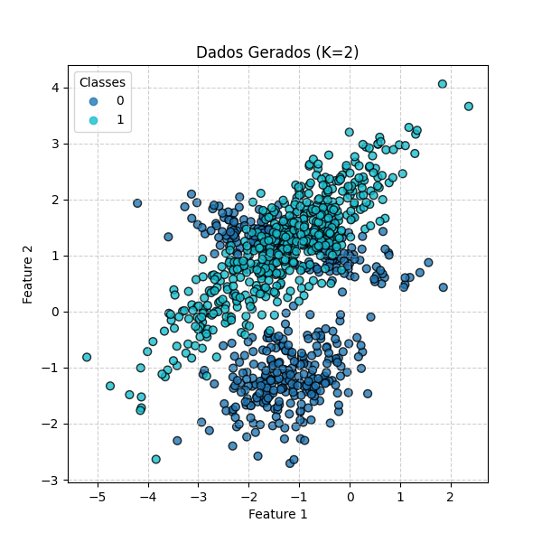

# Deep Learning — Multi-Layer Perceptron (MLP)

**Autor:** *Caio Ortega Boa*  
**Disciplina:** Deep Learning  
**Período:** 2025.1  
[Link do Repositório](https://github.com/CaioBoa/-MultiLayerPerceptrons)

---

## Sumário

- **Exercício 1** Cálculo Manual de uma MLP
- **MLP**: rede com camadas ocultas `tanh` e saída `softmax`  
- **Exercício 2:** Classificação binária  
- **Exercício 3:** Classificação multiclasse 
- **Exercício 4:** Classificação multiclasse (+ camadas ocultas)

---

## Exercício 1 — Cálculo Manual de uma MLP

**Descrição do modelo.**  
MLP com **2 entradas**, **1 camada oculta (2 neurônios)** e **1 neurônio de saída**.  
Ativações: **`tanh`** na oculta **e** na saída. **Loss:** **MSE**.

### 1) Dados do problema (preencher)
- **Entrada (vetor coluna):** x = [ 0.5 , 0,2]
- **Saída desejada:** y = 1.0 
- **Pesos da camada oculta** W1 = [[0.3 , -0.1][0.2, 0.4]]
- **Vieses da camada oculta** b1 = [0.1 , -0.2]
- **Pesos da saída** W2 = [0.5, -0.3]
- **Viés da saída** b2 = 0.2 
- **Taxa de aprendizado:** eta = 0.3

### 2) Forward pass
- **Pré-ativações na oculta:** z1 = W1 @ x + b1 = [0.27, -0.18]
- **Ativações na oculta:** a1 = tanh(z1) = [0.2636, -0.1780]
- **Pré-ativação na saída:** z2 = W2 @ a1 + b2 = 0.3852  
- **Saída da rede:** y^ = tanh(z2) = 0.3672

### 3) Loss (MSE)
- L = (y - y^)^2 = 0.4003

### 4) Backward pass
- dl/dy^ = -2*(y - y^) = -1.2655  
- dy^/dz2 = 1 - tanh(z2)^2 = 0.8651
- dl/dz2 = -1.0948
- dL/dW2 = dl/dz2 * a1^T = [-0.2886, 0.1949]
- dL/db2 = dl/dz2 = -1.0948
- dL/da1 = W2^T * dl/dz2 = [-0.5474, 0.3180]
- da1/dz1 = 1 - tanh(z1)^2 = [0.9305, 0.9682]
- dL/dz1 = (W2^T*dl/dz2) * (1 - tanh(z1)^2) = [-0.5093, 0.3180]
- dL/dW1 = dL/dz1 * x^T = [[-0.2546, 0.1018][0.1590, -0.0636]]
- dL/db1 = dL/dz1 = [-0.5093, 0.3180]

### 5) Atualização dos parâmetros (Gradient Descent)
- W2 = W2 - eta * dL/dW2 = [0.5865, -0.3584]
- b2 = b2 - eta * dL/db2 = 0.5284
- W1 = W1 - eta * dl/dW1 = [[0.3764, -0.1305][0.1522, 0.4190]]
- b1 = b1 - eta * dL/db1 = [0.2528, -0.2954]  

## MLP

**Objetivo.** Implementar uma MLP **modular** em NumPy, suportando:
- **Entrada genérica** (`input_dim = n_features`);
- **N camadas ocultas** (lista de larguras), **ativação `tanh`** em todas as ocultas;
- **Camada de saída `softmax`** com `output_dim = n_classes`;
- **Loss:** *categorical cross-entropy*;
- **Otimização:** *Gradient Descent*;.

**Fluxo do treino.**  
1. Inicialização dos parâmetros;  
2. *Forward*;  
3. *Loss*;  
4. *Backward*;  
5. *Gradient Descent*;  

```python
# mlp.py
from __future__ import annotations
from typing import List, Optional
import numpy as np

from utils import (
    tanh, dtanh_from_a,
    softmax, one_hot, cross_entropy, accuracy_score,
    xavier_init,
)

class MLP:
    def __init__(
        self,
        input_dim: int,
        hidden_layers: List[int] = [16, 16],
        output_dim: int = 2,        
        lr: float = 0.05,
        max_epochs: int = 500,
        batch_size: Optional[int] = None,
        random_state: Optional[int] = 42,
        track_history: bool = True,
    ):
        self.input_dim = input_dim
        self.hidden_layers = hidden_layers
        self.output_dim = output_dim
        self.lr = lr
        self.max_epochs = max_epochs
        self.batch_size = batch_size
        self.random_state = random_state
        self.track_history = track_history

        self.params_ = None
        self.loss_history_: List[float] = []
        self.acc_history_: List[float] = []

    # ---------- initialization ----------
    def _init_params(self, rng: np.random.Generator) -> None:
        layer_sizes = [self.input_dim] + self.hidden_layers + [self.output_dim]
        W, b = [], []
        for l in range(1, len(layer_sizes)):
            fan_in = layer_sizes[l-1]
            fan_out = layer_sizes[l]
            W_l = xavier_init(fan_in, fan_out, rng)
            b_l = np.zeros((fan_out, 1))
            W.append(W_l)
            b.append(b_l)
        self.params_ = {"W": W, "b": b}

    # ---------- forward ----------
    def _forward(self, X: np.ndarray):
        W, B = self.params_["W"], self.params_["b"]
        A = X.T  
        caches = [{"A": A}]  

        # hidden layers
        for l in range(len(self.hidden_layers)):
            Z = W[l] @ A + B[l]
            A = tanh(Z)
            caches.append({"Z": Z, "A": A})

        # output layer (softmax)
        ZL = W[-1] @ A + B[-1]
        P = softmax(ZL, axis=0)
        caches.append({"Z": ZL, "A": P})
        return caches, P.T

    # ---------- backward ----------
    def _backward(self, caches, y: np.ndarray):
        W = self.params_["W"]
        L = len(W)
        m = y.shape[0]

        A0 = caches[0]["A"]
        A_list = [A0] + [c["A"] for c in caches[1:]]

        Y = one_hot(y.reshape(-1), self.output_dim).T
        P = A_list[-1]

        dZ = (P - Y) / m
        dW = [None] * L
        dB = [None] * L

        # última camada
        A_prev = A_list[-2]
        dW[L-1] = dZ @ A_prev.T
        dB[L-1] = np.sum(dZ, axis=1, keepdims=True)

        # ocultas
        for l in reversed(range(L-1)):
            dA = W[l+1].T @ dZ
            A_l = A_list[l+1]
            dZ = dA * dtanh_from_a(A_l)

            A_prev = A_list[l]
            dW[l] = dZ @ A_prev.T
            dB[l] = np.sum(dZ, axis=1, keepdims=True)

        return dW, dB

    # ---------- update ----------
    def _update(self, dW, dB, lr: float) -> None:
        for l in range(len(self.params_["W"])):
            self.params_["W"][l] -= lr * dW[l]
            self.params_["b"][l] -= lr * dB[l]

    # ---------- fit ----------
    def fit(self, X: np.ndarray, y: np.ndarray):
        rng = np.random.default_rng(self.random_state)
        self._init_params(rng)

        m = X.shape[0]
        batch_size = self.batch_size or m

        for epoch in range(1, self.max_epochs + 1):
            idx = rng.permutation(m)
            X_shuf = X[idx]
            y_shuf = y[idx]

            for start in range(0, m, batch_size):
                end = min(start + batch_size, m)
                Xb = X_shuf[start:end]
                yb = y_shuf[start:end]

                caches, _ = self._forward(Xb)
                dW, dB = self._backward(caches, yb)
                self._update(dW, dB, self.lr)

            if self.track_history:
                P_full = self.predict_proba(X)
                Y_full = one_hot(y, self.output_dim)
                loss = cross_entropy(Y_full, P_full)
                y_pred = np.argmax(P_full, axis=1)
                acc = accuracy_score(y, y_pred)
                self.loss_history_.append(loss)
                self.acc_history_.append(acc)

        return {"epochs_run": self.max_epochs}

    def predict_proba(self, X: np.ndarray) -> np.ndarray:
        _, P = self._forward(X)
        return P

    def decision_function(self, X: np.ndarray) -> np.ndarray:
        W, B = self.params_["W"], self.params_["b"]
        A = X.T
        for l in range(len(self.hidden_layers)):
            A = tanh(W[l] @ A + B[l])
        ZL = W[-1] @ A + B[-1]
        return ZL.T

    def predict(self, X: np.ndarray) -> np.ndarray:
        P = self.predict_proba(X)
        return np.argmax(P, axis=1)
```

**Funções Auxíliares**
```python
# utils.py
from __future__ import annotations
import numpy as np

# -----------------------------
# Ativações e derivadas
# -----------------------------
def tanh(z: np.ndarray) -> np.ndarray:
    return np.tanh(z)

def dtanh_from_a(a: np.ndarray) -> np.ndarray:
    return 1.0 - a**2

def softmax(Z: np.ndarray, axis: int = 0) -> np.ndarray:
    """
    Z: (K, m) -> aplica softmax por coluna (axis=0).
    Retorna prob. por classe, colunas somam 1.
    """
    Z_shift = Z - np.max(Z, axis=axis, keepdims=True)
    e = np.exp(Z_shift)
    return e / np.sum(e, axis=axis, keepdims=True)

# -----------------------------
# Loss e métricas
# -----------------------------
def bce_loss(y_true: np.ndarray, y_prob: np.ndarray, eps: float = 1e-12) -> float:
    y_prob = np.clip(y_prob, eps, 1.0 - eps)
    return float(-np.mean(y_true * np.log(y_prob) + (1 - y_true) * np.log(1 - y_prob)))

def cross_entropy(y_true_oh: np.ndarray, y_prob: np.ndarray, eps: float = 1e-12) -> float:
    """
    y_true_oh: (m, K) one-hot
    y_prob   : (m, K) probabilidades (softmax)
    """
    y_prob = np.clip(y_prob, eps, 1.0 - eps)
    return float(-np.mean(np.sum(y_true_oh * np.log(y_prob), axis=1)))

def accuracy_score(y_true: np.ndarray, y_pred_labels: np.ndarray) -> float:
    return float(np.mean(y_true == y_pred_labels))

# -----------------------------
# Split 80/20
# -----------------------------
def train_test_split(X: np.ndarray, y: np.ndarray, test_size: float = 0.2, random_state: int = 42):
    rng = np.random.default_rng(random_state)
    m = X.shape[0]
    idx = rng.permutation(m)
    m_test = int(np.floor(test_size * m))
    test_idx = idx[:m_test]
    train_idx = idx[m_test:]
    return X[train_idx], X[test_idx], y[train_idx], y[test_idx]

# -----------------------------
# Inicializações
# -----------------------------
def xavier_init(fan_in: int, fan_out: int, rng: np.random.Generator) -> np.ndarray:
    std = np.sqrt(2.0 / (fan_in + fan_out))
    return rng.normal(0.0, std, size=(fan_out, fan_in))

# -----------------------------
# Helpers
# -----------------------------
def one_hot(y: np.ndarray, K: int) -> np.ndarray:
    """
    y: (m,) com rótulos inteiros [0..K-1]
    retorna: (m, K) one-hot
    """
    m = y.shape[0]
    Y = np.zeros((m, K), dtype=float)
    Y[np.arange(m), y.astype(int)] = 1.0
    return Y
```

**Pré-processamento.**  
- **MinMax [-1, 1]** nos atributos, para combinar com ativação **tanh** nas ocultas.

```python
from __future__ import annotations
import numpy as np

class MinMaxScaler:
    """
    Escala os dados para o intervalo [-1, 1].
    """
    def __init__(self):
        self.min_: np.ndarray | None = None
        self.max_: np.ndarray | None = None

    def fit(self, X: np.ndarray) -> "MinMaxScaler":
        self.min_ = X.min(axis=0)
        self.max_ = X.max(axis=0)
        return self
    
    def transform(self, X: np.ndarray) -> np.ndarray:
        if self.min_ is None or self.max_ is None:
            raise RuntimeError("Scaler não ajustado. Chame fit() antes de transform().")
        
        # normaliza para [0, 1]
        X_norm = (X - self.min_) / (self.max_ - self.min_ + 1e-12)
        # reescala para [-1, 1]
        return 2.0 * X_norm - 1.0
    
    def fit_transform(self, X: np.ndarray) -> np.ndarray:
        return self.fit(X).transform(X)
```

**Geração de Dados**
```python
from __future__ import annotations
import numpy as np
from sklearn.datasets import make_classification
import matplotlib.pyplot as plt

def make_varying_classification(
    n_samples: int,
    n_classes: int,
    n_features: int,
    clusters_per_class,
    class_sep: float = 1.2,           
    flip_y: float = 0.2,
    random_state: int = 42,
    shuffle: bool = False,
):
    """
    Gera dados sintéticos com nº de clusters variável por classe,
    usando make_classification de forma simplificada.

    - Divide amostras de forma uniforme entre as classes
    - n_informative = n_features
    - n_redundant = 0
    - class_sep e flip_y ajustáveis
    """
    clusters_per_class = list(clusters_per_class)
    if n_classes < 2 or len(clusters_per_class) != n_classes:
        raise ValueError("clusters_per_class deve ter n_classes elementos e n_classes >= 2.")

    # Divide amostras uniformemente
    base = n_samples // n_classes
    counts = [base] * n_classes
    for i in range(n_samples - base * n_classes):
        counts[i] += 1

    X_parts, y_parts = [], []
    for c, m_c in enumerate(counts):
        seed_c = (random_state + 10007 * (c + 1)) % (2**31 - 1)
        X_c, _ = make_classification(
            n_samples=m_c,
            n_features=n_features,
            n_informative=n_features,
            n_redundant=0,
            n_repeated=0,
            n_classes=2,               
            n_clusters_per_class=clusters_per_class[c],
            weights=[1.0, 0.0],        
            class_sep=class_sep,
            flip_y=flip_y,
            shuffle=True,
            random_state=seed_c,
        )
        X_parts.append(X_c)
        y_parts.append(np.full(m_c, c, dtype=int))

    X = np.vstack(X_parts)
    y = np.concatenate(y_parts)

    if shuffle:
        rng = np.random.default_rng(random_state)
        idx = rng.permutation(X.shape[0])
        X, y = X[idx], y[idx]

    return X, y

def plot_classification_data(X: np.ndarray, y: np.ndarray, title: str = "Synthetic Data"):
    """
    Plota os dados 2D gerados por make_varying_classification.
    
    Parâmetros:
      X : np.ndarray (n_samples, 2) -> features
      y : np.ndarray (n_samples,)   -> rótulos (0, 1, ..., n_classes-1)
      title : título opcional do gráfico
    """
    if X.shape[1] != 2:
        raise ValueError("O plot só funciona para n_features=2.")
    
    plt.figure(figsize=(6, 6))
    scatter = plt.scatter(X[:, 0], X[:, 1], c=y, cmap="tab10", edgecolor="k", s=40, alpha=0.8)
    plt.xlabel("Feature 1")
    plt.ylabel("Feature 2")
    plt.title(title)
    plt.legend(*scatter.legend_elements(), title="Classes")
    plt.grid(True, linestyle="--", alpha=0.6)
    plt.show()
```

---

## Exercício 2 — Classificação Binária

**Objetivo.** Treinar uma MLP em um conjunto de dados binários, com clusters assimétricos e 2 features.

### Especificação dos Dados
- **Amostras:** 1000  
- **Classes:** 2  
- **Features:** 2 
- **Clusters por classe:** `[2, 1]`



### Pipeline
- **Split:** 80% treino / 20% teste;  
- **Scaler:** **MinMax [-1,1]**;  
- **MLP:**  
  - Entrada: `input_dim = 2`;   
  - Saída: `output_dim = 2` (**softmax**);     
  - Épocas: 500;

### Resultados
Foram realizados testes com **1 camada oculta de profundidade 1**, **1 camada oculta de profundidade 16** e **2 camadas ocultas de profundidade 16**.

- **Train Loss:** 0.4671, 0.4634, 0.2879  
- **Train Accuracy:** 0.7750, 0.7738, 0.8538  
- **Test Loss:** 0.4553, 0.4509, 0.2763
- **Test Accuracy:** 0.8000, 0.8050, 0.8500

![Loss por época para [1]](Ex111.png)
![Accuracy por época par [1]](Ex112.png)
![Loss por época para [16]](Ex121.png)
![Accuracy por época par [16]](Ex122.png)
![Loss por época para [16, 16]](Ex131.png)
![Accuracy por época par [16, 16]](Ex132.png)

---

## Exercício 3 / 4 — Classificação Multiclasse

**Objetivo.** Treinar uma MLP em um conjunto de dados com 3 classes distintas, clusters assimétricos e 4 features.

### Especificação dos Dados
- **Amostras:** 1500  
- **Classes:** 3  
- **Features:** 4  
- **Clusters por classe:** `[2, 3, 4]`  

### Pipeline
- **Scaler:** **MinMax [-1,1]**;  
- **MLP:**  
  - Entrada: `input_dim = 4`;  
  - Saída: `output_dim = 3`;  
  - Épocas: 500;  

### Resultados
Foram realizados testes com **1 camada oculta de profundidade 16**, **2 camada oculta de profundidade 16** e **3 camadas ocultas de profundidade 16**.

- **Train Loss:** 0.7644, 0.5351, 0.4725  
- **Train Accuracy:** 0.6142, 0.7625, 0.7817  
- **Test Loss:** 0.7889, 0.6355, 0.5803
- **Test Accuracy:** 0.5933, 0.6767, 0.7200

![Loss por época para [16]](Ex211.png)
![Accuracy por época par [16]](Ex212.png)
![Loss por época para [16, 16]](Ex221.png)
![Accuracy por época par [16, 16]](Ex222.png)
![Loss por época para [16, 16, 16]](Ex231.png)
![Accuracy por época par [16, 16, 16]](Ex232.png) 
